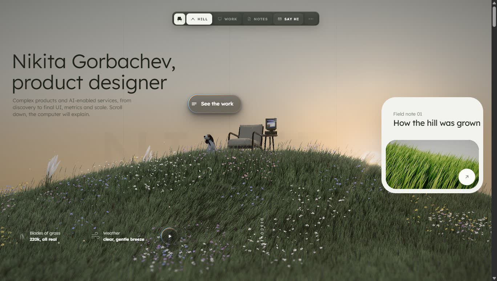
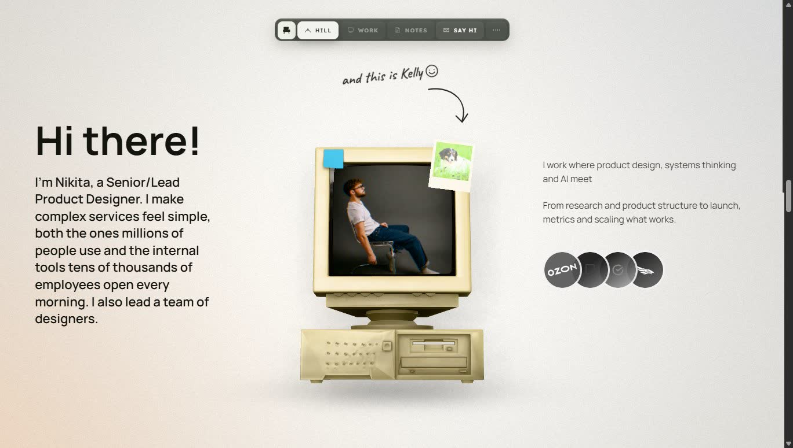
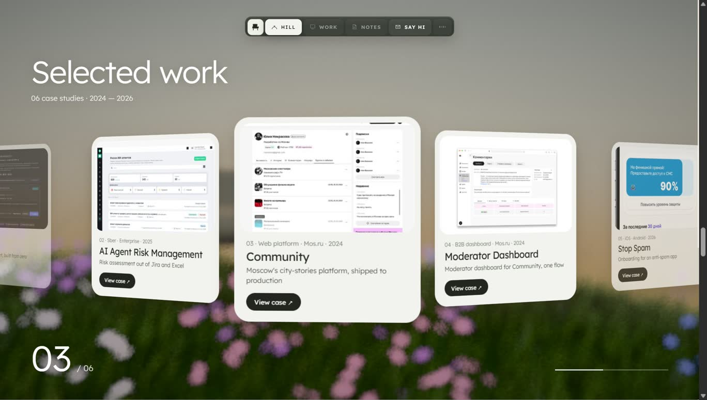
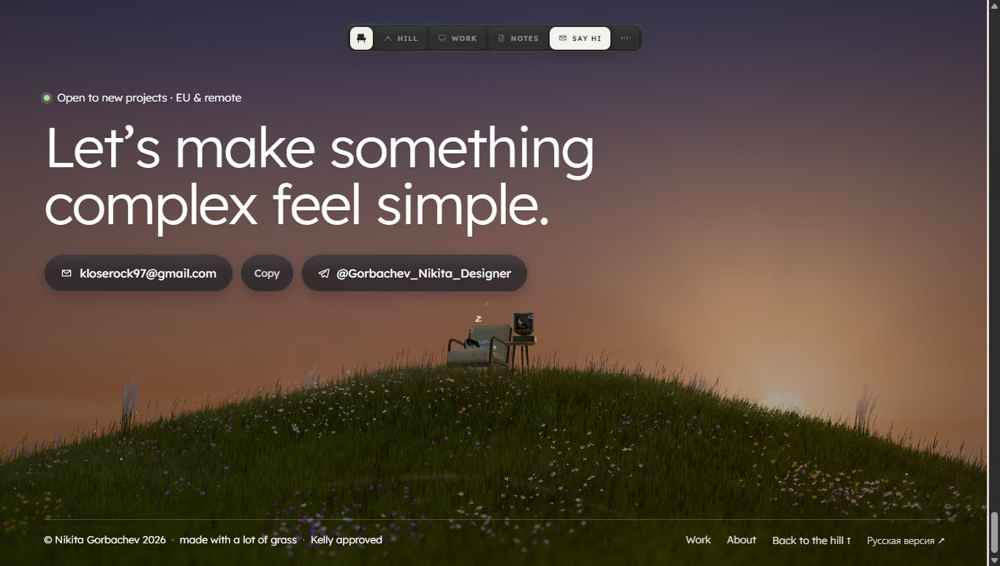

# Gorbachev Nikita — Product Designer

Portfolio of Nikita Gorbachev, product designer. It opens on a grassy hill at sunset with an armchair, an old CRT computer and Kelly the dog. Scroll down and the computer flies off the table to tell you who I am, then the page tears away to show the case studies, and the story ends back on the hill at dusk with contacts.

**Live site:** https://kloserock97-tech.github.io/gorbachev-nikita-product-designer/



| About | Case studies | Footer |
| --- | --- | --- |
|  |  |  |

## What's on the page

The first screen is a real-time scene, framed the way a photograph would be: the hill sits in the right third, its ridge runs down to the left and leads the eye to the "See the work" button, and the armchair stands on the golden-ratio line with open sky above it for the title. The sun is behind the hill’s shoulder, so the grass is lit from behind. Behind the hill four ridges fade into the sky by aerial perspective, a lone tree stands over the armchair with the sun shining through its crown, and mossy boulders sit in the grass. Every blade of grass is geometry (up to 220k instances in one draw call, bent by wind in the vertex shader), and the dog looks at your cursor. Clicking "Weather" cycles through clear sky, clouds, rain and dusk. In the rain Kelly gets a small umbrella hat.

Scrolling drives a three-part story:

1. The hill unloads and the computer lifts off the table, landing on a white page with the About text. The hand-off is the transition from igloo, ported whole: the camera pulls back, a wave runs through the grass, the frame smears in rays from the centre while the colour channels drift apart towards its edges, and a fill climbs from the bottom with a ragged, cloud-like border. A kinetic line of type slows down and becomes the "Hi there!" heading.
2. The page tears away from the bottom. Behind it the same meadow is blurred and seen from the grass. The Work chapter is an editorial spread: a ribbon of large cards rides sideways with the scroll, each holding a real product screen, and the active one sits in the middle. Around it the satellites fly apart and then float — the case number, the platform pill with its switch, a label with the tag, the product mark, the cut-out object on a small tile, and the headline figure from the case’s own results («6 → 0 hand-to-hand transfers»). Under the card: the title, the year and a round button into the case. Scroll, swipe, the step buttons and the arrow keys all move between cases. The old wheel of titles on an arc is still there under `?cases=wheel`. Each case opens as its own page inside the site (`#/work/<id>`): a hero stage with the real product screen in a device, then the facts, the problem, the solution, results and what I learned. The case colour, the ink and the accent are the same on the card in the Work menu, on the case page and in the «next case» block.
3. The camera returns to the hill at dusk. Fireflies come out, Kelly sleeps curled up in the armchair, and the footer holds the contacts: a mail button, Telegram, LinkedIn and the address itself, which copies when you click it.

The note card on the first screen flips through four of my side projects: [Windcrest](https://github.com/kloserock97-tech/windcrest) (the grass of this hill as a demo of its own), [Driftfield](https://github.com/kloserock97-tech/driftfield) (a particle cloud in a curl-noise field), [Nightsail](https://github.com/kloserock97-tech/nightsail) (a giant marble head surfacing from a night sea under a column of light) and [Meadow Walk](https://github.com/kloserock97-tech/meadow-walk) (an endless flight over a windy meadow). Each has a live demo with every parameter on a panel.

The retro computer can also be clicked on the hill. Its screen shows a small 2000s-style home page.

The page speaks English and Russian. The globe in the dock switches between them without a reload, and the choice is remembered and written into the address, so a shared link opens in the same language. The first visit follows the browser's language. Case studies have their own Russian texts, not a translation of the English ones.

Sound is off until the first click or tap: a quiet nature background made with Web Audio plus short UI cues. `M` toggles it.

If the browser has no WebGL2, renders on the CPU, or can't hold even the lowest quality tier, the site switches to a lite version: a normal scrolling page with a still of the hill, the About text, a grid of cases and the contacts. You can also open it with `?lite=1`.

## Running it

You need Node 22 or newer.

```bash
npm install
npm run dev       # http://127.0.0.1:5190/
npm run build     # production build into dist/
npm run preview   # serve dist/ locally
npm run check     # type check, build, and a report of unused dictionary keys, CSS classes and public files
npm run bundle    # what each built script is made of, by source file
npm run deadcode  # unused files and exports (knip, fetched on demand)
npm run smoke     # walk through home, menu, story, cases and a case page in headless Chrome (needs preview on 5191)
npm run audit:loader  # 17 checks of the loading screen (needs preview on 5191)
npm run test:case-entry  # a link straight to a case must show its title within 3s on a mid laptop (needs preview on 5191)
npm run test:gl   # loading the scene on a slow CPU must not produce a single WebGL error (needs preview on 5191)
```

Useful URL parameters while developing:

| Parameter | Effect |
| --- | --- |
| `?intro=0` / `?intro=1` | skip or force the loading screen |
| `?garden=0.5` / `?gardentier=0..4` | freeze the loading screen at a growth value; pin its quality step |
| `?cases=wheel` / `wheel2d` / `wheel3d` / `ribbon` / `deck` | other views of the Work chapter: the wheel of titles on an arc (and the same without WebGL, or with it forced on phones), the old ribbon of cards, a stack. Any value shows a small switcher at the bottom |
| `?story=0.62` | jump to a point of the scroll story (0 to 1) |
| `?tblur=0.55` / `?taberr=0.03` | strength of the transition’s radial smear and chromatic aberration |
| `?tier=0` | pin the quality step (the lowest ones drop the god rays) |
| `?rayshalo=5` / `?raysmask=0.85,2.2` | how wide the sun’s halo is in the god-ray mask and from what brightness the frame feeds it |
| `?lite=1` / `?lite=0` | force the lite version or force 3D |
| `?debug=1` | show the quality tier, DPR and FPS |
| `?dpr=1.5&msaa=2` | fix the render resolution and MSAA (disables auto quality) |
| `?tree=0` / `?rocks=0` | hide the tree or the boulders |
| `?shield=0` | let the god rays wash over the armchair and computer as they did before |
| `?governor=0` | switch off the GPU-timer governor (use it with `?tier=`, or the tier drifts) |
| `?dog=rain` / `?dog=sleep` | put the umbrella hat on Kelly or send her to sleep |
| `?ui=0` | hide the interface, scene only |
| `?lang=ru` / `?lang=en` | open the page in that language |

## How it's built

Vite, TypeScript and three.js (WebGL2). There is no UI framework; the interface is plain HTML and CSS on top of the canvas, and the scroll story is a function of scroll progress.

```
src/
  main.ts            entry: picks 3D or lite, wires the interface to the scene
  scene/             everything rendered in WebGL
    HillScene.ts     scene setup, render loop, quality tiers, scroll story
    story.ts         story timing: chapters, camera paths, keyframes
    postfx.ts        render targets and the post-processing chain
    shaders.ts       GLSL for grass, sky, fog, god rays, final pass
    quality.ts       GPU-timer quality governor
    dog.ts           Kelly: poses, head tracking, sleep, umbrella hat
    weather.ts       clear / cloudy / rain / dusk
    ...
  intro/             the loading screen: a slab of frosted glass that overgrows with moss while the hill loads
    garden/          what lies on the slab: glass, ice, moss, flowers, water, post-processing
  ui/                HTML/CSS interface: hero, story texts, case strip and case pages, footer, lite version
    fonts.css        self-hosted fonts and the serif accent class
    icons.ts         one icon set in the style of the dock icons
    caseLook.ts      the look of a case (stage colours, object) shared by the card, the menu and the case page
    case-cards.css   the case card; case-story.css — the case page
    casesWheel.ts    the Work chapter: titles on an arc, the case card and the text
    casesCardPreview.ts  the card itself: a light sheet with the product screen and the result figure, satellites around it
    casesWheelGl.ts  the old cut-out object preview, kept behind ?cases=wheel
    hero/            first screen: layout, dock, metal buttons, parallax
  audio/             nature ambience and UI sound cues
  data/              texts and case list; case stories are one file per language, loaded on demand
  i18n/              the two dictionaries and the language switch
  lib/               small shared helpers (math, formatting, display-time typography)
public/              models (Draco GLB), HDRI, fonts, images, sounds
tools/               Blender build scripts and Chrome DevTools measurement scripts
docs/                dev log, prompts behind each iteration, load test report
```

### Rendering

The scene renders into a half-float MSAA target. God rays run at quarter resolution, and a single full-screen pass does tone mapping, grading, grain and the page effects (the white page, the torn edge, the kinetic type). The computer gets its own pass with studio lights when it sits on the white page.

Behind the case cards the meadow is fully blurred, so it renders cheaply there. It goes into a half-resolution buffer with a third of the grass and no god rays, and it updates every other frame. The final pass drops to half resolution too. On an Intel Arc iGPU at DPR 2.25 that brings a case-study frame down from 7.8 ms to 2.7 ms.

### Quality

On load the page measures frame time and picks one of nine tiers. On desktops the tiers trade MSAA first, then resolution, then grass density and god rays; on screens with a DPR below 1.5 the top tier supersamples the scene at DPR 1.5 and the final pass filters it down. Phones get their own ladder: their tile-based GPUs resolve MSAA almost for free, so grass density and rays go first, MSAA 4× stays until the seventh step, and the lowest three steps drop MSAA for a higher resolution with edge smoothing in the final pass. Browsers without a GPU timer (every browser on iPhone) fall back to frame intervals: if the idle hill runs slower than 45 fps, the tier goes down. The choice is cached per GPU and screen for two weeks. While you look at the hill, a governor reads GPU time through `EXT_disjoint_timer_query_webgl2` and moves the tier up or down by one step.

Shaders compile in parallel before the first frame (`KHR_parallel_shader_compile`). Models that arrive later compile after the HDRI is in, because the environment map changes the program key. Without that, the first frame blocked the main thread for about 2.4 seconds on a fast desktop.

### Measuring

The `tools/` scripts drive a headless Chrome over the DevTools protocol:

- `load-test.mjs` runs nine device profiles (fast desktop, laptop with a slow CPU, software rendering, good and budget phones, reduced motion, no WebGL, lost context, rotation) and records load time, per-chapter frame intervals, long tasks and layout shifts. Results for the current version are in [docs/load-test-report.md](docs/load-test-report.md) (in Russian).
- `cdp-profile.mjs` records a CPU profile of a page or of a moment in the story.
- `cdp-eval.mjs`, `cdp-shot.mjs` and `cdp-frames.mjs` evaluate code, take screenshots and capture frame sequences.
- `cdp-story-shots.mjs` shoots the scroll story at a list of progress values (`--ps 0.04,0.1,0.34`) from a single page load.
- `pre-shader-stalls.js` with `cdp-eval.mjs --pre tools/pre-shader-stalls.js --fresh` lists shader programs that block the main thread on a cold cache. `cdp-profile.mjs --lines <function>` splits a function's self time by source line.
- `cdp-touch.mjs` emulates a phone with a real finger in Chrome and runs gesture scripts from `tools/touch/*.json` (swipe, fling, screenshot, probe).
- `cdp-cards.mjs` walks the Work chapter and the side projects on a phone: a finger swipe forward and back, the step buttons, the arrow keys, and whether the chapter stays put when the browser's address bar slides in and out (it changes `innerHeight` without moving the page).
- `crop.ps1` crops and enlarges a screenshot region without smoothing, to inspect single pixels.
- `site-study.mjs` studies somebody else's page for reference: screenshots while scrolling plus the numbers behind the look (the type scale actually used, tracking, line height, tile radii and backgrounds, button sizes). Nothing from the page is stored except numbers and frames for yourself.
- `audit-nature-loader.mjs` checks the loading screen: growth phases, focus, clean-up, reduced motion, deep links, context loss, frame pace.
- `case-entry-test.mjs` opens `#/work/<case>` on a cold profile and fails if the case title takes longer than the budget (3s on a mid laptop with CPU ×4, 1.5s on a fast desktop). A link to a case is the most common way in, and the case page must not wait for the hill.
- `gl-errors-test.mjs` loads the scene with the CPU throttled and fails on any WebGL error, using `pre-gl-errors.js` to ask `getError()` after every draw call. A run where the scene barely rendered counts as void, not as a pass.
- `unused.mjs` lists dictionary keys, CSS classes and `public/` files that nothing refers to. `bundle-report.mjs` splits every built script by source file through its source map.
- `lib/chrome.mjs` is the shared Chrome launcher: it frees the debugging port from a browser left by an interrupted run and shuts the browser down on any exit.
- `?tier=0..8` forces a quality tier and `?edgeaa=0|1` toggles edge anti-aliasing of the final pass.

The scripts look for Chrome at the default Windows path. Set `CHROME=/path/to/chrome` on other systems.

Measure against `npm run build` + `npm run preview`. The dev server loads dozens of separate modules, and that skews loading numbers (frame times are the same).

### Assets pipeline

The armchair, the computer and the dog are prepared headless in Blender 5.1 with the scripts in `tools/blender-build-*.py`, then compressed with Draco (`npx @gltf-transform/cli draco`). Source `.blend` files are not in the repository.

The objects are cut out of generated still lifes (prompts and provenance in [docs/case-preview-art-direction.md](docs/case-preview-art-direction.md)). A plain background remover eats glass, so the matte is built from two parts: the model's mask, and the colour difference from the fitted studio background inside everything the mask encloses. For the Work chapter the objects stand on the dark field with nothing behind them, so the matte also drops the pale glow the render has around every object, repaints the two-pixel ring at the contour with colour taken from inside, and smooths the contour instead of eroding it. The cut-outs ship as AVIF with a WebP fallback, plus a small depth map per object for the WebGL view.

## Deploying

`.github/workflows/deploy.yml` builds the site and publishes `dist/` to GitHub Pages on every push to `main`. The build uses relative paths (`base: "./"`), so it works from a project page such as `https://<user>.github.io/<repo>/`.

## Credits and licenses

| What | Source | License |
| --- | --- | --- |
| Dog "Kelly" | ["Low Poly Dog"](https://sketchfab.com/3d-models/low-poly-dog-15d4cf0ad6bc418fa63872a9f5f37734) by Jéssica Magno; repainted, fluffy tail, new poses, umbrella hat | CC BY 4.0 |
| Armchair | ["Modern Arm Chair 01"](https://polyhaven.com/a/modern_arm_chair_01) by Vibrant Nordic, Poly Haven; scaled, cushions recoloured | CC0 |
| Side table | ["Side Table Tall 01"](https://polyhaven.com/a/side_table_tall_01) by James Ray Cock, Poly Haven; legs shortened | CC0 |
| "Old computer 02" | Freepoly.org via BlenderKit | CC0 |
| Mug and saucer | made in code, `tools/blender-build-props.py` | this project |
| Tree, boulders, distant ridges | generated in code, `src/scene/tree.ts`, `rocks.ts`, `vista.ts` | this project |
| HDRI `qwantani_sunset_puresky` | Poly Haven | CC0 |
| UI sound cues | uisfx (uisfx.com), "zen" set | CC0 |
| Onest, Playfair Display (italic), Caveat fonts | Google Fonts, self-hosted in `public/fonts` | OFL, text in `public/fonts/OFL.txt` |
| three.js, Draco decoder | three.js authors; Google | MIT; Apache-2.0 |
| "Hash without Sine" in the grass shader | David Hoskins | MIT |
| Grass rendering ideas | "Procedural Grass in Ghost of Tsushima", GDC 2021 | reference only |

The full list with license texts ships with the site as [`THIRD_PARTY_LICENSES.txt`](public/THIRD_PARTY_LICENSES.txt) and is linked from the footer ("Credits").

Nikita's own source code is released under the MIT license ([LICENSE](LICENSE)); the files and assets above keep their own licenses. Texts, photos, case study images and the portfolio content itself belong to Nikita Gorbachev and are not covered by that license.

## Contact

Nikita Gorbachev · kloserock97@gmail.com · Telegram [@Gorbachev_Nikita_Designer](https://t.me/Gorbachev_Nikita_Designer) · LinkedIn [nikita-gorbachev-productdesigner](https://www.linkedin.com/in/nikita-gorbachev-productdesigner)
